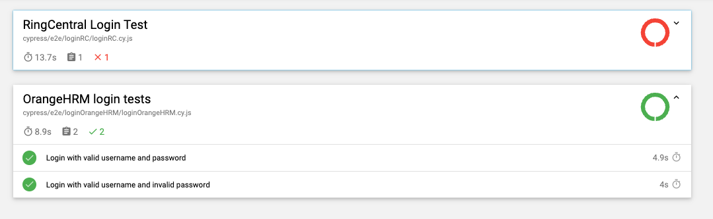

# cypress-demo

This project is used for practicing Cypress E2E testing.

The test scripts are located in <code>cypress/e2e</code>

To run the tests:  
<code>npm run e2e</code>

The report of test results will be shown as <code>index.html</code> in <code>cypress/reports</code>

[Example report](./cypress/assets/report_example.html)

The reporter is generated by [cypress-mochawesome-reporter](https://github.com/LironEr/cypress-mochawesome-reporter.git)
